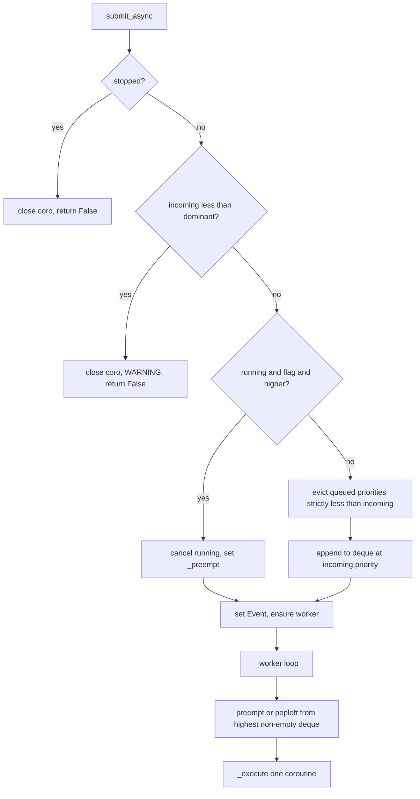

# Migrate to dict + deque task queue

## Goal

Replace the waiting-store in [`priority_task_queue.py`](priority_task_queue.py) from `asyncio.PriorityQueue` to:

```python
_queues: dict[TaskPriority, deque[QueuedTask]]
```

with one FIFO `deque` per `TaskPriority`, while preserving the behaviors documented in [`README.md`](README.md) (rules 1–6). Rename the public surface as you requested:

| Current | New |
|---------|-----|
| `priority_task_queue.py` | `task_queue.py` |
| `AsyncPriorityTaskQueue` | `AsyncTaskQueue` |
| `test_priority_task_queue.py` | `test_task_queue.py` |

`check_for_exceptions.py` stays unchanged.

## Rules mapping (unchanged semantics)



| Rule | How deque dict satisfies it |
|------|-----------------------------|
| **1** | `_execute` still runs one `asyncio.Task` at a time; default path does not cancel running |
| **1 (opt-in)** | Same interrupt branch: `can_interrupt_running` + `incoming > _running_priority` → cancel + `_preempt` |
| **2** | Interrupt only when flag is set; tests unchanged |
| **3** | On non-interrupt enqueue: for each `p in TaskPriority` where `p < incoming.priority`, `popleft` all tasks from `_queues[p]` and `_close_task` |
| **4–5** | Worker scans priorities **high → low** (`CRITICAL` … `LOW`); within each level, `deque` append + `popleft` = FIFO |
| **6** | `_dominant_priority()` = max of `_running_priority` and highest non-empty deque key; reject if `incoming.priority < dominant` |

## Core implementation changes ([`task_queue.py`](task_queue.py) — new file)

### 1. Storage and init

```python
from collections import deque

_PRIORITIES_DESC: tuple[TaskPriority, ...] = tuple(
    sorted(TaskPriority, key=lambda p: p.value, reverse=True)
)

self._queues: dict[TaskPriority, deque[QueuedTask]] = {
    p: deque() for p in TaskPriority
}
```

Keep: `_lock`, `_work_available`, `_preempt`, `_running_*`, `_worker_task`, `_stopped`, `_async_to_sync_tasks`, `submit` / `submit_async` / `cancel` / `_execute` structure.

Remove: `asyncio.PriorityQueue`, `_sort_key`, `_drain_waiting`, `_refill_waiting`.

### 2. Small helpers (replace queue-specific logic)

- `_has_waiting() -> bool` — any deque non-empty
- `_waiting_count() -> int` — `sum(len(d) for d in self._queues.values())` for `queue_size`
- `_highest_queued_priority() -> TaskPriority | None` — first non-empty level in `_PRIORITIES_DESC`
- `_dominant_priority() -> TaskPriority | None` — max of running vs highest queued (reuse existing static helper pattern or inline)
- `_evict_queued_below(priority: TaskPriority) -> None` — drain deques for `p < priority`, close coroutines
- `_pop_highest_waiting() -> QueuedTask | None` — walk `_PRIORITIES_DESC`, `popleft` from first non-empty deque

### 3. Simplify `submit_async` (main behavioral win)

**Do not** drain all waiting tasks on every submit (current code does, and on the interrupt path it never refills `waiting`, which would drop queued work if interrupt happened with a non-empty queue).

New flow under `async with self._lock`:

1. If stopped → close incoming, `False`
2. Compute `dominant`; if `incoming.priority < dominant` → close, log WARNING, `False` (rule 6)
3. If interrupt → cancel/await running, set `_preempt = incoming` (**do not** touch `_queues`)
4. Else → `_evict_queued_below(incoming.priority)` then `_queues[incoming.priority].append(incoming)` (rules 3 + 4–5)
5. `_ensure_worker()` + `_work_available.set()` → `True`

### 4. Worker and cancel

**`_worker`**: stop when `_stopped and _preempt is None and not _has_waiting()`; else preempt → else `_pop_highest_waiting()`; empty → clear event and wait.

**`cancel`**: under lock, set stopped, cancel running, drain every deque with `_close_task`, clear `_preempt`, set event; then await running/worker as today.

### 5. `QueuedTask` / sequence

`sequence` and `_next_sequence()` were only used for `PriorityQueue` ordering. **Remove** them; FIFO is enforced by deque order alone. Update docstrings to reference `AsyncTaskQueue`.

### 6. Docstrings and logging

Update class/module docstrings to describe `dict[TaskPriority, deque[QueuedTask]]` instead of `asyncio.PriorityQueue`. Worker task name: `task_queue_worker`.

## Test and docs updates

### [`test_task_queue.py`](test_task_queue.py)

- Import from `task_queue`: `AsyncTaskQueue`, `TaskPriority`
- Replace `AsyncPriorityTaskQueue()` with `AsyncTaskQueue()`
- Keep all rule-labeled tests as-is (they encode rules 1–6); only import/class renames unless a test referenced `_close_coroutine` on the old module path (still valid on new class)

### [`README.md`](README.md)

- Reframe intro: experiment uses **per-priority deques in a dict**, not `asyncio.PriorityQueue`
- Keep the rules table unchanged
- `uv run pytest -v` remains the verification command

### Cleanup

- Delete [`priority_task_queue.py`](priority_task_queue.py) and [`test_priority_task_queue.py`](test_priority_task_queue.py) after creating replacements
- Optional: update `pyproject.toml` `name` / `description` to match (cosmetic; not required for tests)

## Verification

```bash
cd /Users/terryso/scoville_projects/test_priority_queue
uv run pytest -v
```

All existing tests should pass without behavior changes to the rules:

- `test_only_one_task_runs_at_a_time` — rule 1
- `test_higher_priority_does_not_cancel_running` — rule 2
- `test_higher_priority_evicts_lower_queued` — rule 3
- `test_fifo_within_same_priority` — rules 4–5
- `test_interrupt_*` — rule 1 opt-in
- `test_rule6_*` + `test_rejected_coroutine_is_closed` — rule 6 + cleanup

## Risk notes

- **Ordering**: `_PRIORITIES_DESC` must sort by `TaskPriority.value` descending so pop order matches old `(-priority.value, sequence)` ordering.
- **Rule 6 on reject**: in-place design avoids accidental queue mutation on reject (no refill needed).
- **Interrupt + queued work**: new submit path preserves queued tasks during preempt (fix for latent drain-without-refill issue in current interrupt branch).
