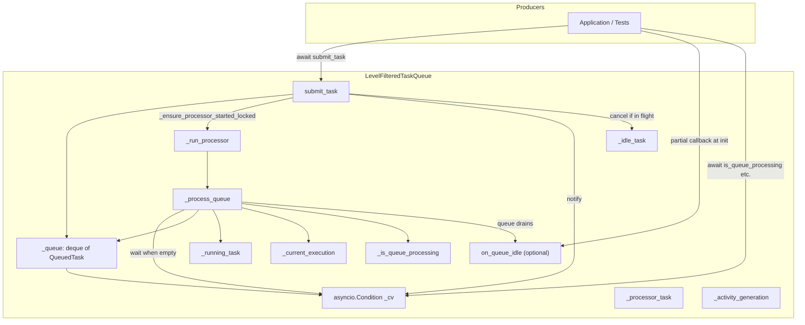
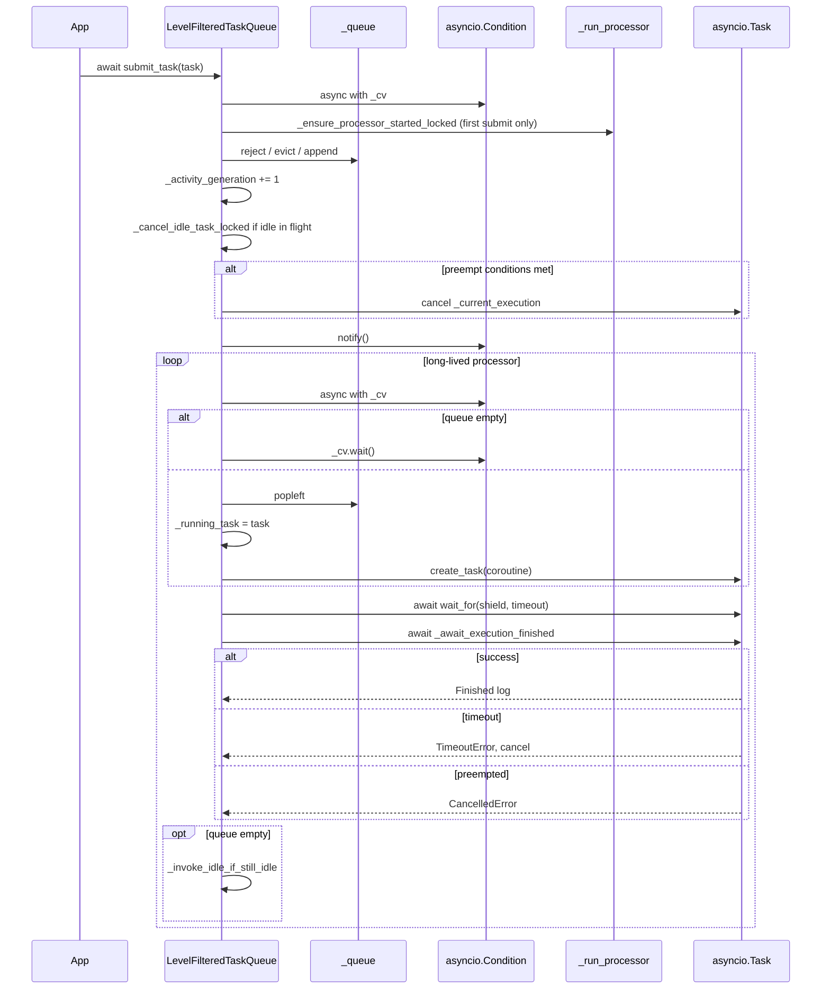
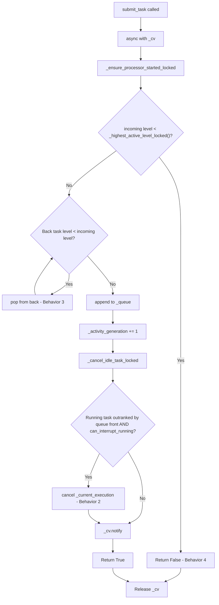
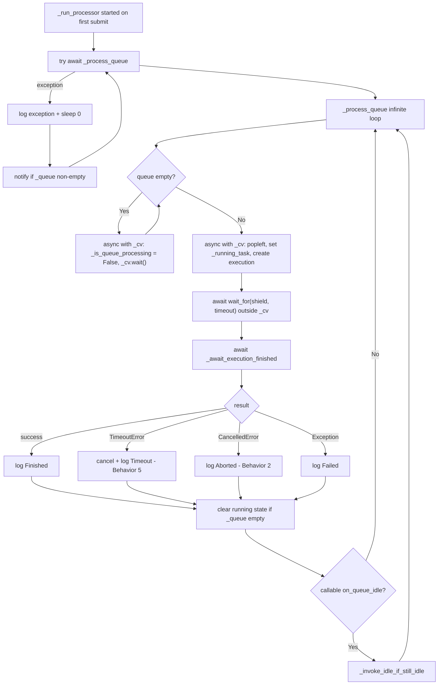
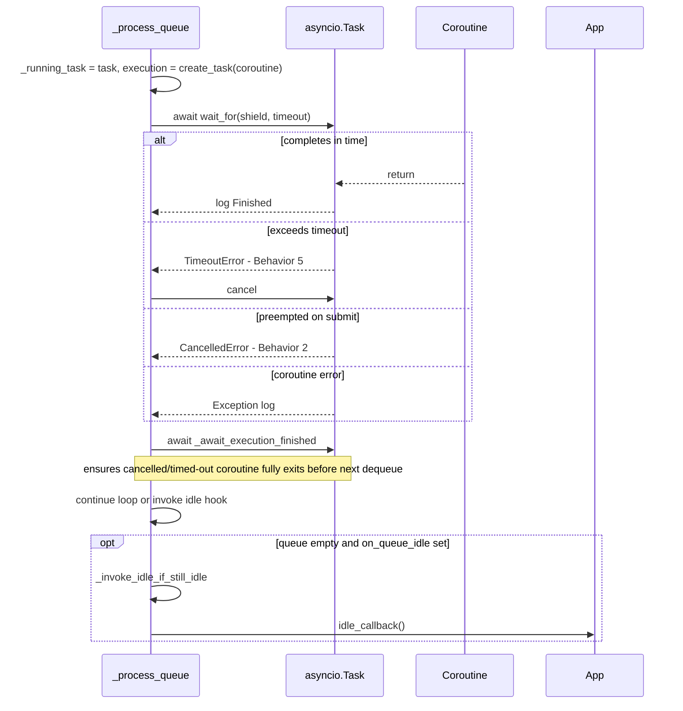
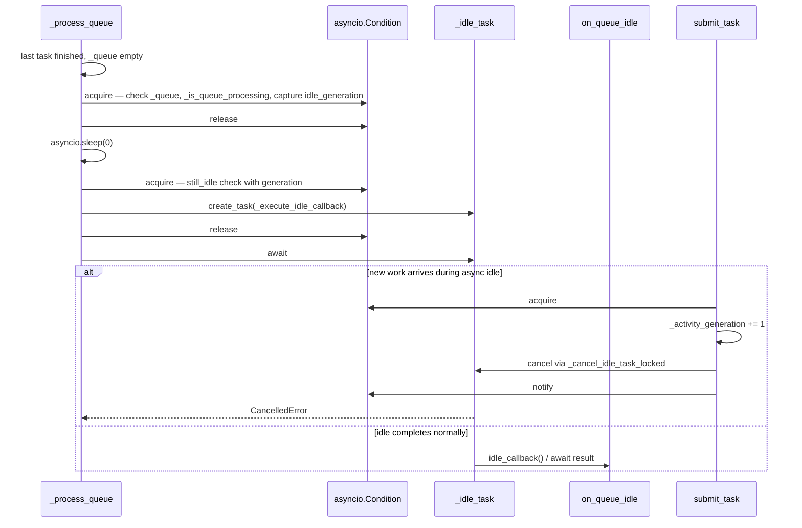
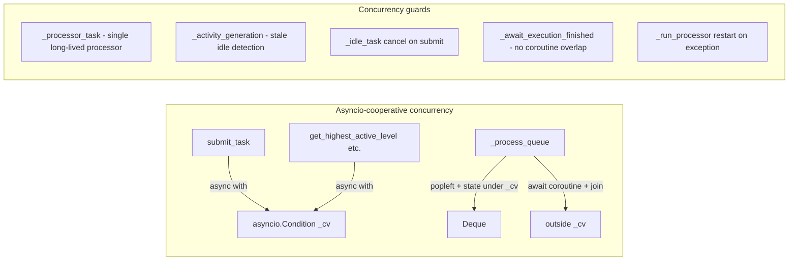
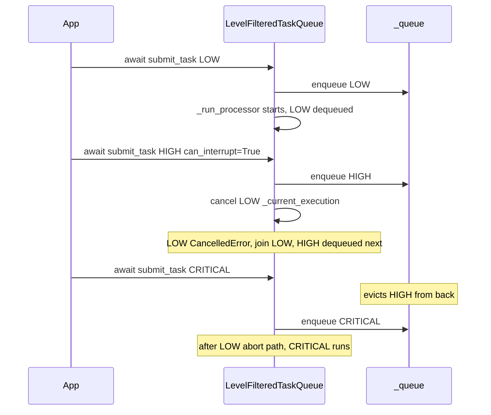
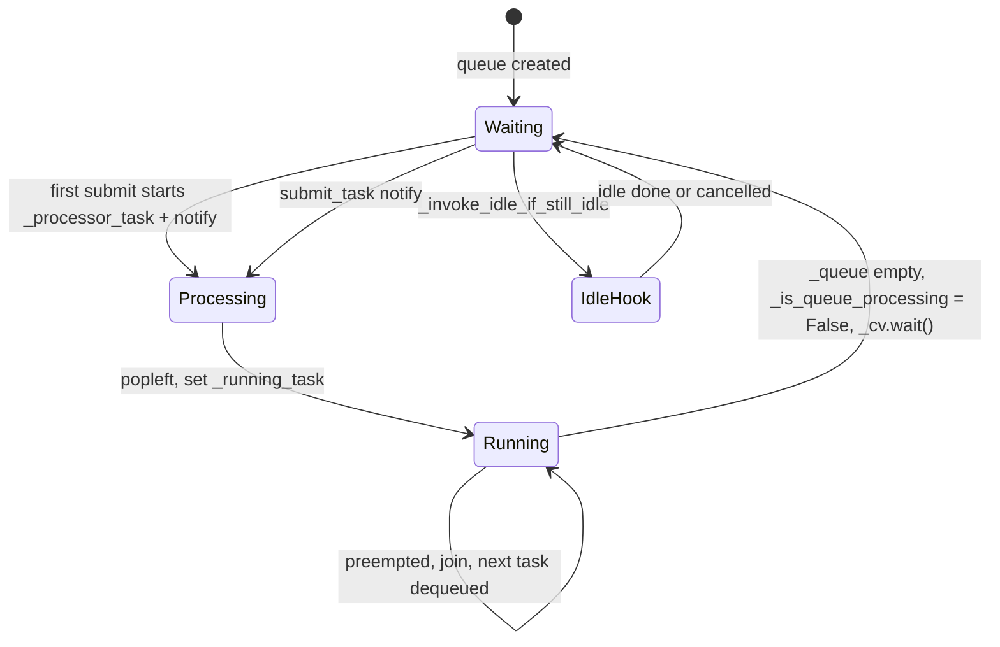

# System Architecture Workflow

## High-Level Overview

This system is a **single-queue, serialized async task queue** with level-based filtering. Producers `await submit_task(QueuedTask)` on `LevelFilteredTaskQueue`; exactly one coroutine runs at a time, with optional preemption on submit, queue eviction, per-task timeouts, and an optional idle callback.

A **single long-lived processor** (`_run_processor` → `_process_queue`) is started lazily on the first accepted `submit_task` and blocks on `asyncio.Condition.wait()` when the queue is empty. New work wakes it via `notify()`.



## Core Components

| Component | Responsibility |
|-----------|----------------|
| [`TaskLevel`](task_queue.py) | Priority enum: `LOW(0) < NORMAL(1) < HIGH(2) < CRITICAL(3)` |
| [`QueuedTask`](task_queue.py) | Task payload: `level`, `name`, `coroutine`, `can_interrupt_running` (default `False`), `timeout` (default `120` seconds) |
| [`LevelFilteredTaskQueue`](task_queue.py) | Enqueue filtering, preemption, queue draining, execution, and optional idle notification |

### Queue State (private internals)

| Field | Purpose |
|-------|---------|
| `_queue` | `deque[QueuedTask]` — FIFO waiting tasks |
| `_running_task` | Currently executing `QueuedTask` |
| `_current_execution` | `asyncio.Task` wrapping the running coroutine |
| `_is_queue_processing` | `True` while dequeuing or executing; `False` while blocked on an empty queue |
| `_on_queue_idle` | Optional `Callable[..., Any] \| None` — sync or async hook invoked when the queue fully drains |
| `_cv` | `asyncio.Condition` — synchronizes all queue mutations, processor wakeups, and public snapshots |
| `_activity_generation` | Incremented on each accepted submit; used to detect stale idle notifications |
| `_processor_task` | Handle to the long-lived `_run_processor` asyncio task |
| `_idle_task` | Handle to an in-flight idle callback; cancelled by `submit_task` when new work arrives |

### Public async accessors

All external reads of queue state go through methods that acquire `_cv`:

| Method | Returns |
|--------|---------|
| `get_highest_active_level()` | Max `TaskLevel` among running + queued tasks, or `None` |
| `is_queue_processing()` | Whether the processor is actively dequeuing or executing |
| `get_running_task()` | Current `QueuedTask` or `None` |
| `queued_task_count()` | Number of tasks waiting in `_queue` |

Internal helper `_highest_active_level_locked()` is used by `submit_task` while already holding `_cv`.

### Constructor: `on_queue_idle`

Optional callback for application logic when all queued work finishes (e.g. manual turn-taking → set user turn; auto turn-taking → enable mic).

```python
from functools import partial

async def on_idle(mode: str, mic_controller) -> None:
    if mode == "manual":
        set_user_turn()
    else:
        await mic_controller.enable()

queue = LevelFilteredTaskQueue(
    on_queue_idle=partial(on_idle, "manual", mic_controller),
)
```

- **Type:** `Callable[..., Any] | None` (default `None` — no hook).
- **Invocation:** `idle_callback()` with no arguments; bind values ahead of time via `functools.partial`.
- **Sync or async:** return values are inspected with `inspect.isawaitable`; async callbacks are awaited.
- **When:** after the last task in a drain cycle finishes and `_queue` is empty.
- **Race safety:** double-check under `_cv` using `_activity_generation`, plus `asyncio.sleep(0)` to let blocked submitters run; in-flight idle callbacks are cancelled when new work is accepted.
- **Lock discipline:** the callback runs **outside** `_cv` so it can safely call `submit_task` without deadlock.

## Lifecycle: Submit to Completion



## Workflow 1: Task Submission (`submit_task`)

All submission logic runs under `asyncio.Condition` in [`LevelFilteredTaskQueue.submit_task`](task_queue.py).



**Priority rules on enqueue:**

- **Reject (Behavior 4):** `_highest_active_level_locked()` returns the max level among the running task and all queued tasks. Incoming tasks strictly below that level are rejected (covers both higher-queued and higher-running cases).
- **Evict (Behavior 3):** Remove all strictly lower-level tasks from the back before appending.
- **Preempt (Behavior 2):** After append, if queue front (`_queue[0]`) outranks `_running_task` and has `can_interrupt_running=True`, cancel `_current_execution` immediately — preemption is triggered at submit time, not via a polling loop.
- **Wake processor:** `_cv.notify()` wakes the long-lived processor if it is blocked on `_cv.wait()`.

## Workflow 2: Queue Processing (`_run_processor` / `_process_queue`)

`_run_processor` wraps `_process_queue` in a restart loop for crash recovery. `_process_queue` is an infinite loop that waits on `_cv` when idle and dequeues work when notified.



**Behavior mapping:**

- **Behavior 1 (one at a time):** `_process_queue` awaits each coroutine (plus `_await_execution_finished`) before dequeuing the next; only one `_processor_task` is ever started.
- **Behavior 2 (preemption):** Cancel on submit raises `CancelledError` in the running `wait_for`; processor joins the cancelled execution, then continues to next queued task.
- **Behavior 2 inverse:** Lower-level tasks never preempt — preemption requires `next_task_in_queue.level > running_task.level`.
- **Behavior 5 (timeout):** `asyncio.wait_for(asyncio.shield(...), timeout)` cancels overlong tasks; loop continues to next item after join.
- **Idle hook:** When the queue empties after a task finishes, optional `on_queue_idle` fires once per drain cycle (not while tasks remain queued).

## Workflow 3: Task Execution



**Execution detail:** Task name and level are captured in local variables at dequeue time for logging (no unsynchronized reads of `_running_task`). `asyncio.shield` prevents the inner task from being immediately destroyed on timeout/cancel at the `wait_for` boundary; `_await_execution_finished` then joins the execution task before the next item is dequeued.

## Workflow 4: Queue Idle Hook (`on_queue_idle`)

Application code registers an optional sync or async callback at queue construction. Arguments are bound with `functools.partial` before passing the callable in — the queue always invokes it with `idle_callback()` and no extra parameters.



| Concern | Approach |
|---------|----------|
| Turn-taking / mic control | App logic inside `on_queue_idle`; queue stays domain-agnostic |
| Passing context (mode, controllers) | `functools.partial(handler, arg1, arg2, ...)` at init |
| Concurrent submit before idle fires | `_activity_generation` double-check + `sleep(0)` skips stale idle |
| Submit during async idle callback | `_cancel_idle_task_locked()` cancels `_idle_task` |
| Callback submits a new task | Safe — hook runs outside `_cv` |

## Workflow 5: Concurrency Model



| Concern | Mechanism |
|---------|-----------|
| Concurrent `submit_task` calls | `_cv` wraps reject/evict/append/preempt decision |
| Multiple processor loops | `_ensure_processor_started_locked` only under `_cv`; one `_processor_task` |
| Processor blocked on empty queue | `_cv.wait()` until `notify()` from `submit_task` |
| Preemption race | Preempt check runs inside `submit_task` under `_cv` before releasing |
| Coroutine overlap after cancel | `_await_execution_finished` joins execution before next dequeue |
| Stale idle notification | `_activity_generation` double-check + cancel in-flight `_idle_task` |
| Unsynchronized state reads | Private `_queue` / `_running_task`; public async accessors only |
| Processor crash | `_run_processor` logs, restarts, and `notify()`s if work is queued |
| Cross-thread submit | **Not supported** — single event loop, coroutine-only use |

## End-to-End Example (Preemption + Eviction)



## State Machine (Queue)



## Required Behaviors and Tests

[README.md](README.md) documents behaviors 1–5. [test_task_queue.py](test_task_queue.py) additionally verifies `on_queue_idle` (12 tests total).

| Behavior | Description | Test |
|----------|-------------|------|
| 1 | Only one task runs at a time | `test_only_one_task_runs_at_a_time` |
| 2a | No preempt by default | `test_higher_level_does_not_interrupt_running_task_with_can_interrupt_running_false` |
| 2b | Preempt when `can_interrupt_running=True` | `test_higher_level_interrupt_running_task_with_can_interrupt_running_true` |
| 3 | Higher-level incoming evicts lower queued | `test_higher_level_incoming_tasks_evicts_lower_queued` |
| 4a | Reject when higher-level queued | `test_do_not_enqueue_incoming_task_when_higher_queued` |
| 4b | Reject when higher-level running | `test_do_not_enqueue_incoming_task_when_higher_running` |
| 5 | Timeout stops running task | `test_task_times_out_when_exceeding_limit` |
| 6 | `on_queue_idle` not called between back-to-back tasks | `test_on_queue_idle_not_called_between_back_to_back_tasks` |
| 7 | `on_queue_idle` runs once when queue drains | `test_on_queue_idle_runs_once_when_queue_drains` |
| 8 | `functools.partial` binds args (sync callback) | `test_on_queue_idle_partial_binds_args_before_level_filtered_task_queue` |
| 9 | Async `on_queue_idle` is awaited | `test_on_queue_idle_awaits_async_callback` |
| 10 | `functools.partial` binds args (async callback) | `test_on_queue_idle_partial_binds_args_for_async_callback` |

## Key Files

- Implementation: [task_queue.py](task_queue.py) — `TaskLevel`, `QueuedTask`, `LevelFilteredTaskQueue`
- Behavior specs: [README.md](README.md) — behaviors 1–5
- Verification: [test_task_queue.py](test_task_queue.py) — 12 tests (behaviors 1–5 plus `on_queue_idle`)

## Known Design Notes

- `submit_task` is **async** — uses `asyncio.Condition` and must be called from the event loop.
- Preemption is **submit-driven** (cancel inside `submit_task`), not poll-driven.
- A **single long-lived processor** (`_run_processor` → `_process_queue`) waits on `_cv` when idle; it is started lazily on the first accepted submit under `_cv`.
- `_process_queue` pops and sets `_running_task` / `_current_execution` under `_cv`, but awaits each coroutine outside `_cv`; `_await_execution_finished` joins the execution before the next dequeue.
- `_is_queue_processing` is `True` while dequeuing or executing, `False` while blocked on `_cv.wait()` — query via `await is_queue_processing()`.
- Queue state (`_queue`, `_running_task`) is private; use async accessors for external reads.
- `on_queue_idle` is optional, sync or async, invoked outside `_cv` with generation-based stale-idle guards; in-flight async idle callbacks are cancelled when new work is accepted.
- `_run_processor` restarts automatically if `_process_queue` raises unexpectedly.
- Default per-task `timeout` is **120 seconds** (`QueuedTask.timeout`).
- **Not thread-safe** across OS threads — single event loop, coroutine-only use.
