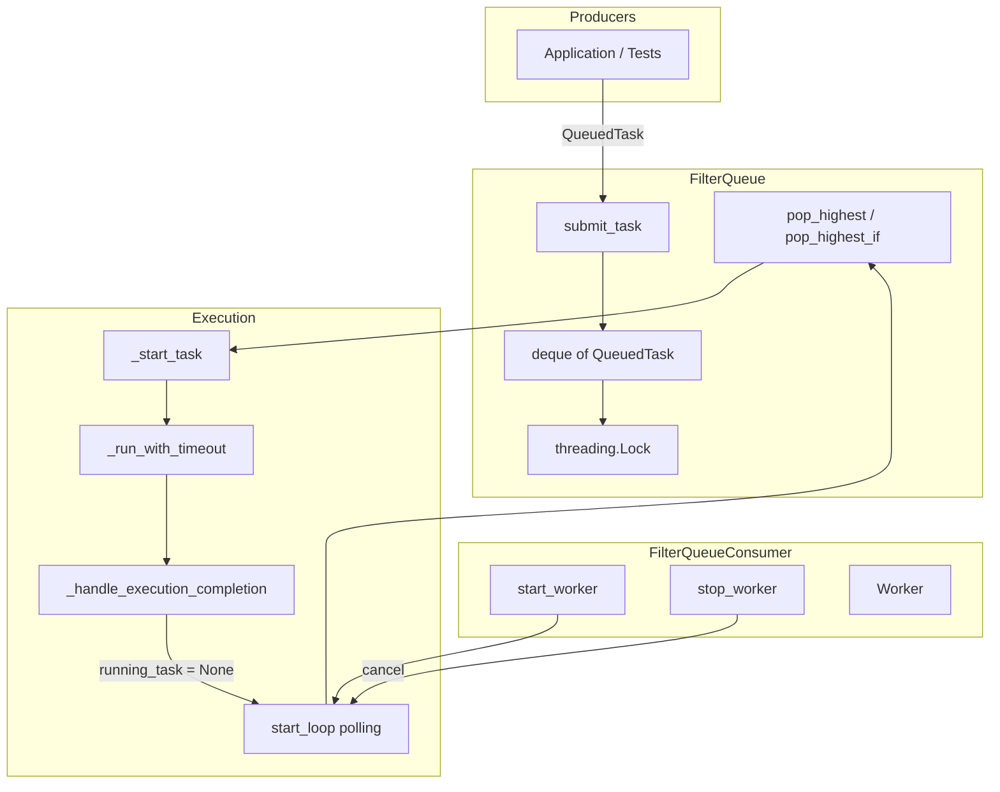
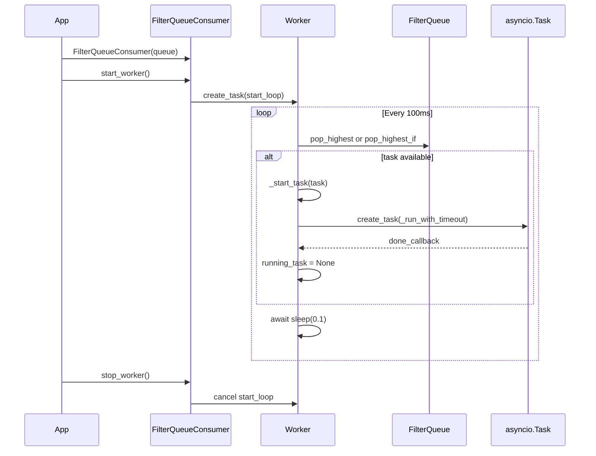
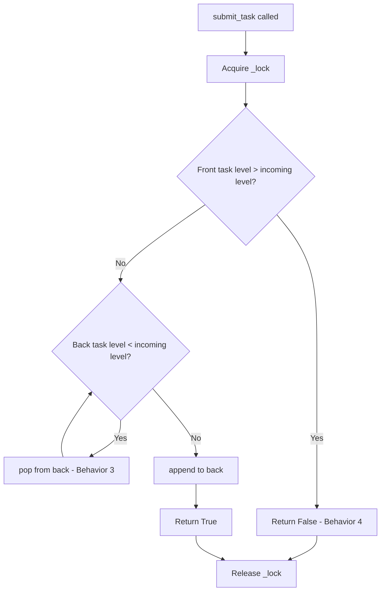
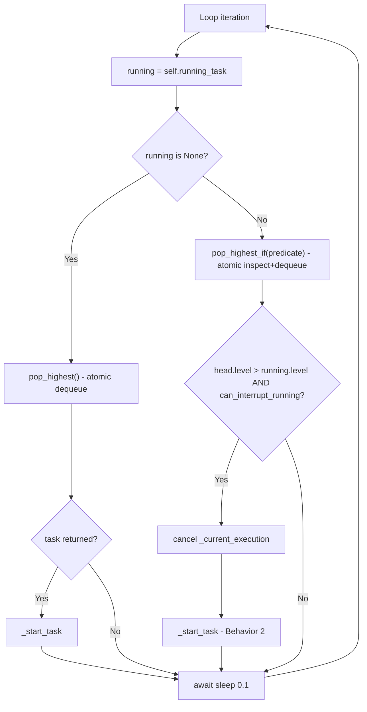
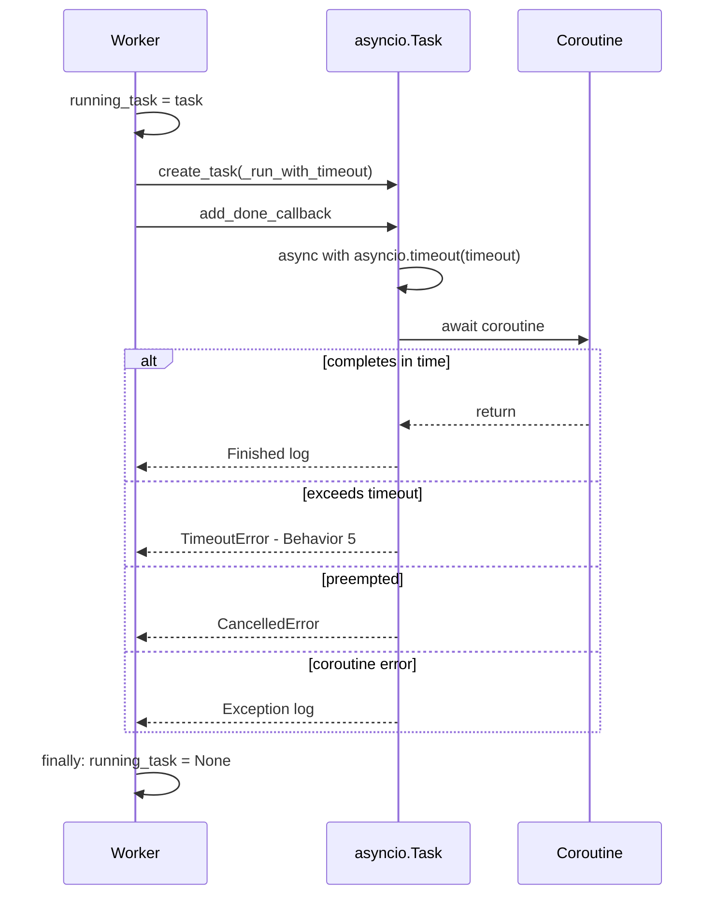
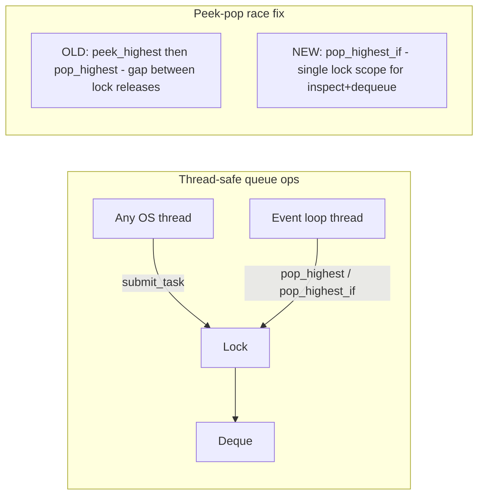
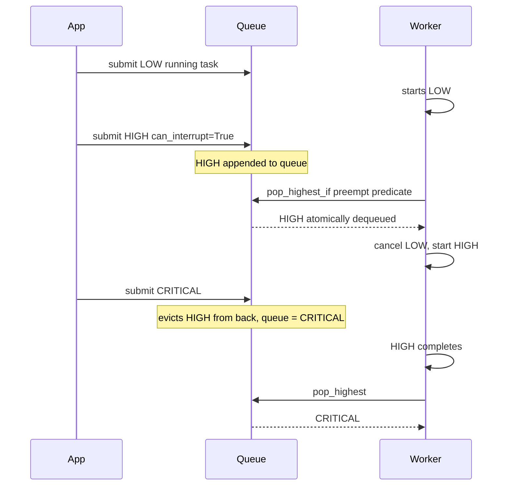
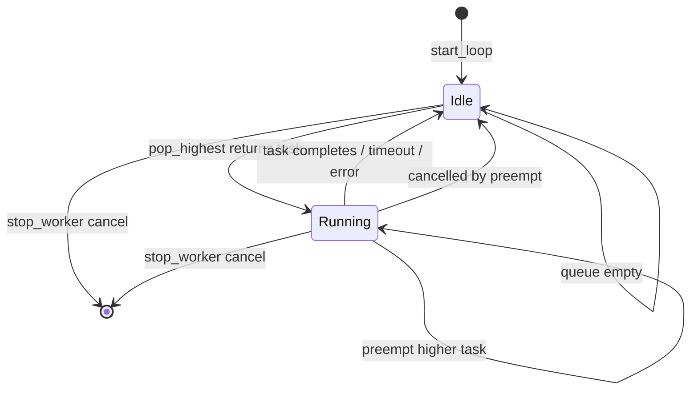

# System Architecture Workflow

## High-Level Overview

This system is a **single-worker, serialized async task queue** with priority filtering. Producers submit `QueuedTask` coroutines; one `Worker` dequeues and runs exactly one task at a time, with optional preemption and per-task timeouts.

## Core Components

| Component | Responsibility |
|-----------|----------------|
| [`TaskLevel`](task_queue.py) | Priority enum: `LOW(0) < NORMAL(1) < HIGH(2) < CRITICAL(3)` |
| [`QueuedTask`](task_queue.py) | Task payload: `level`, `name`, `coroutine`, `can_interrupt_running`, `timeout` |
| [`FilterQueue`](task_queue.py) | Thread-safe priority-filtered `deque`; accepts/rejects/evicts on submit |
| [`Worker`](task_queue.py) | Polls queue, runs one task, handles preemption and completion |
| [`FilterQueueConsumer`](task_queue.py) | Lifecycle wrapper: starts/stops the worker asyncio task |

## Lifecycle: Startup to Shutdown

## Workflow 1: Task Submission (`submit_task`)

All submission logic runs under `threading.Lock` in [`FilterQueue.submit_task`](task_queue.py).

**Priority rules on enqueue:**
- **Reject (Behavior 4):** If queue front has strictly higher level than incoming task, reject.
- **Evict (Behavior 3):** Remove all strictly lower-level tasks from the back before appending.
- **Append:** New task always goes to the back; front remains highest-priority waiting task.

**Note:** Queue ordering assumes front = next to run. Higher-priority tasks submitted later evict lower ones from the back but do not automatically jump ahead of equal/higher front tasks.

## Workflow 2: Worker Monitor Loop (`start_loop`)

The worker polls every **100ms** and branches on whether a task is currently running.

**Behavior mapping:**
- **Behavior 1 (one at a time):** Only one `_current_execution` asyncio task active; new work waits until `running_task` is cleared.
- **Behavior 2 (preemption):** Higher-level queued task with `can_interrupt_running=True` atomically dequeued and running task cancelled.
- **Behavior 2 inverse:** Lower-level tasks never preempt, even with `can_interrupt_running=True`.

## Workflow 3: Task Execution (`_start_task` → `_run_with_timeout`)

**Behavior 5 (timeout):** `asyncio.timeout(timeout)` wraps the coroutine. On timeout, `TimeoutError` is caught, worker is freed in `finally`, and the monitor loop can dequeue the next task.

## Workflow 4: Concurrency Model

| Concern | Mechanism |
|---------|-----------|
| Cross-thread `submit_task` | `threading.Lock` on all deque mutations |
| Peek-then-pop mismatch | `pop_highest_if()` — inspect and dequeue atomically |
| Single-threaded asyncio | No `await` between dequeue decision and `_start_task` in one loop iteration |
| Worker responsiveness | 100ms polling via `asyncio.sleep(0.1)` (not event-driven wakeup yet) |

## End-to-End Example (Preemption + Eviction)

## State Machine (Worker)

## Key Files

- Implementation: [task_queue.py](task_queue.py)
- Behavior specs + test command: [README.md](README.md)
- Verification: [test_task_queue.py](test_task_queue.py) (7 tests covering behaviors 1–5)

## Known Design Notes

- `peek_highest()` remains for read-only inspection but is **not** used by the worker loop (avoids TOCTOU race).
- `submit_task` is **sync** by design — fast in-memory enqueue, safe with `threading.Lock`.
- Worker polls every 100ms rather than using an `asyncio.Event` wakeup (acceptable latency tradeoff).
- Placeholder `pass` in `_handle_execution_completion` (lines 175–178) suggests future integration hooks (e.g. turn-taking / mic control) — not part of current queue behavior.
