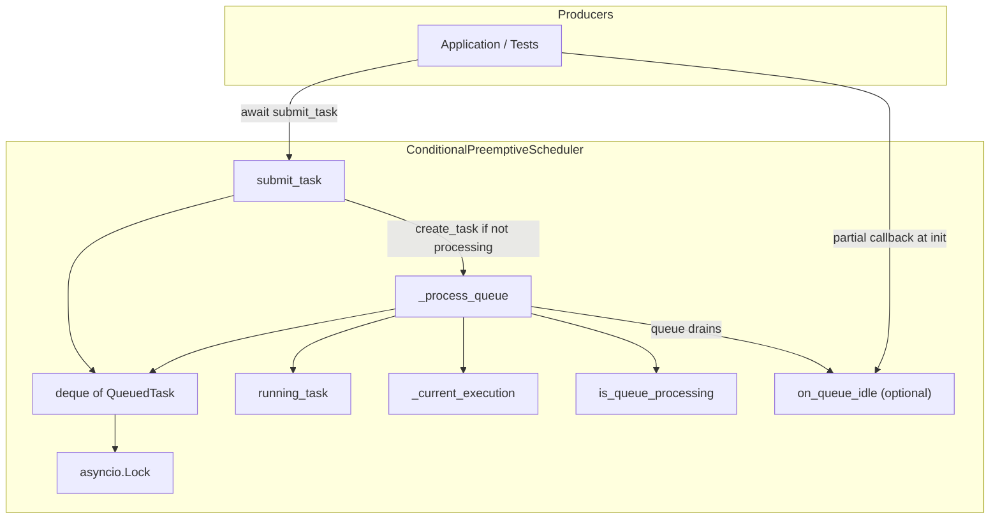
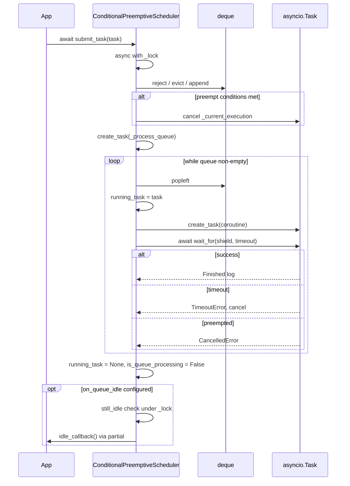
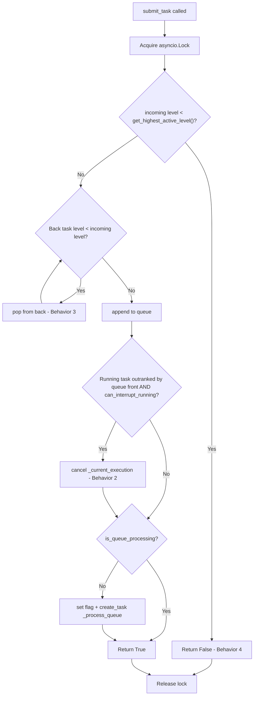
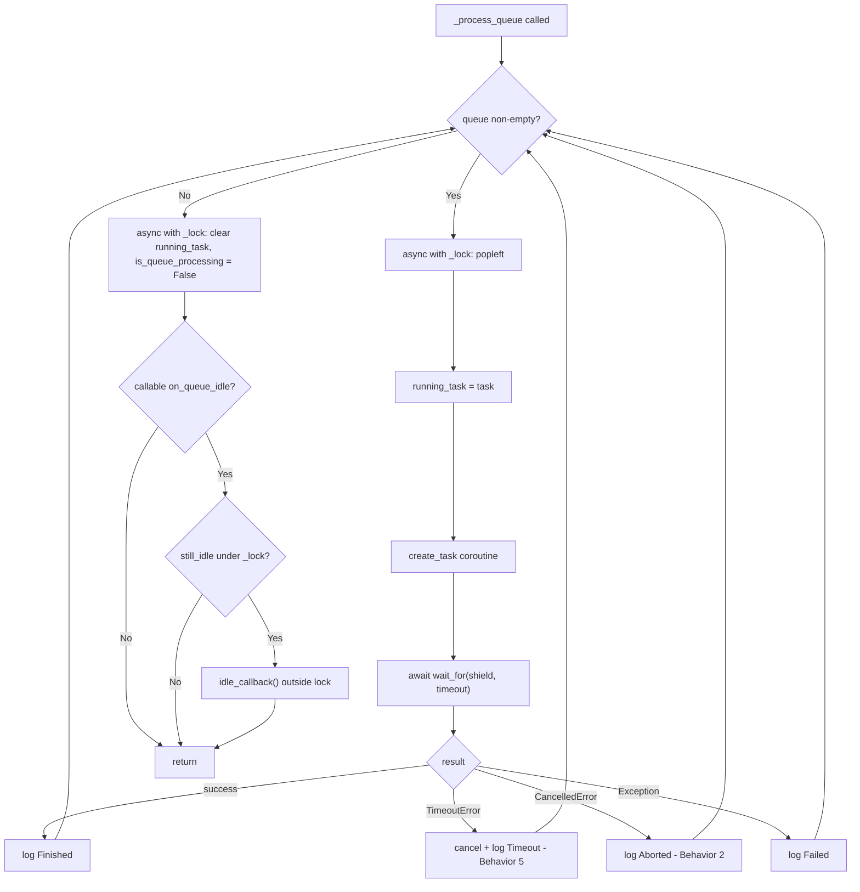
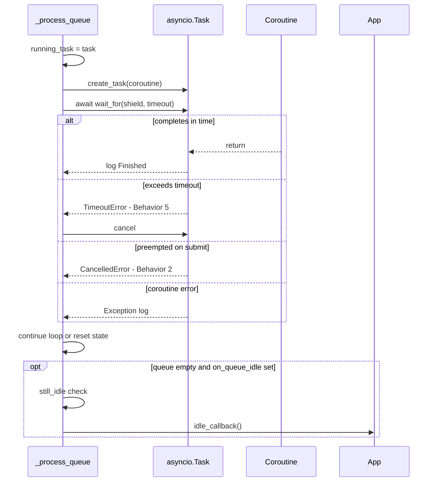
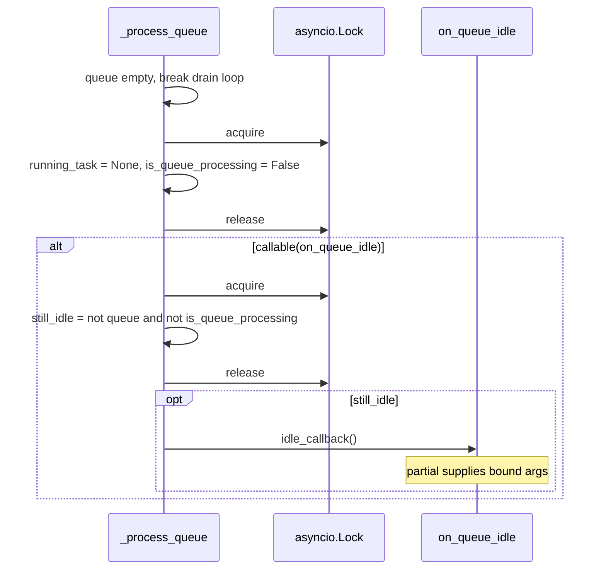
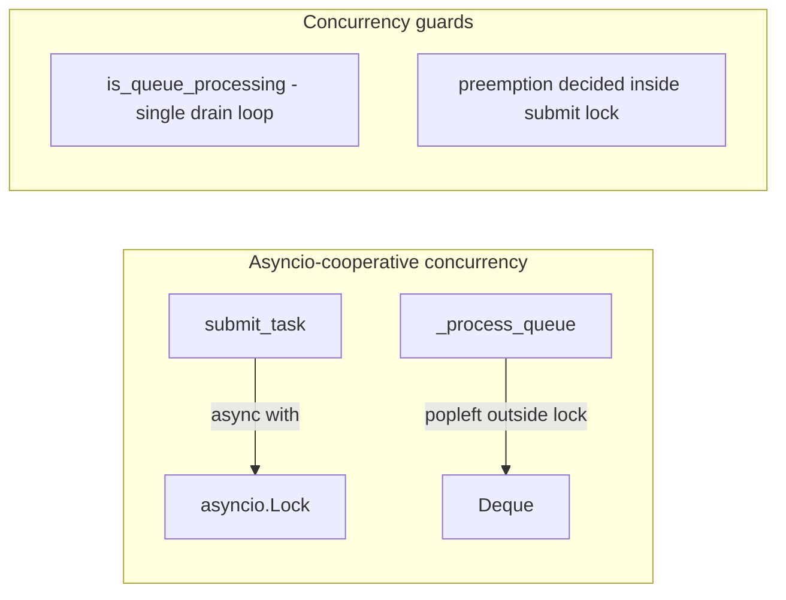
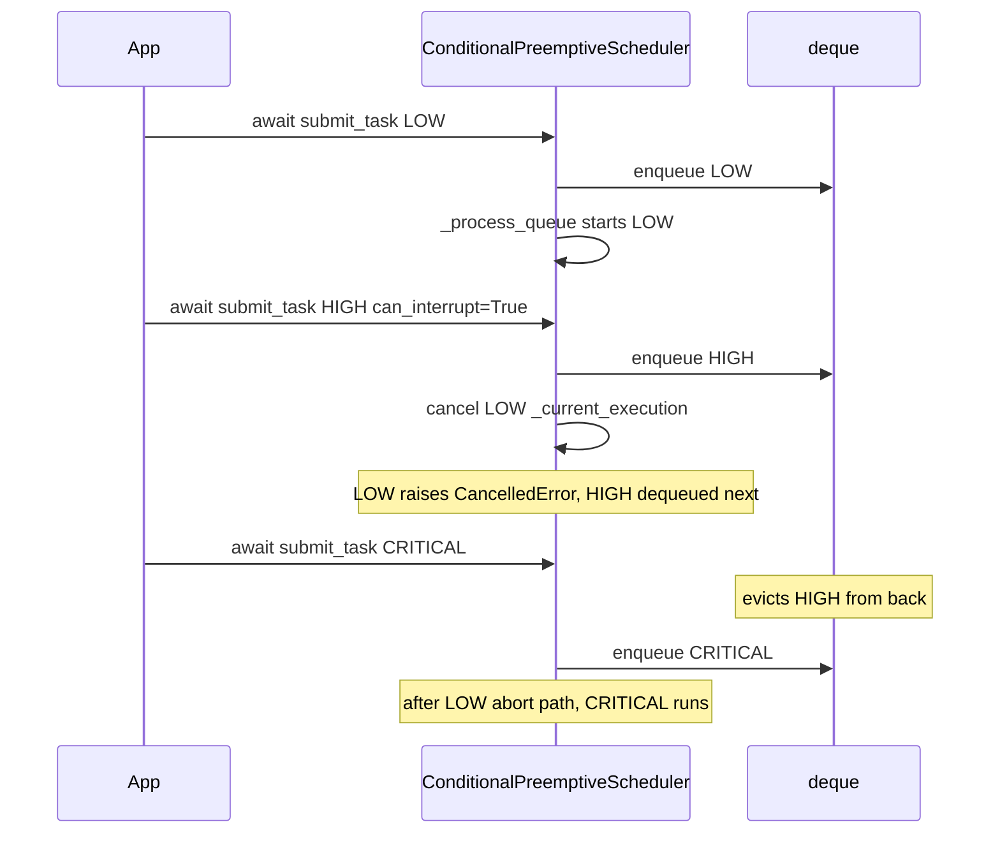
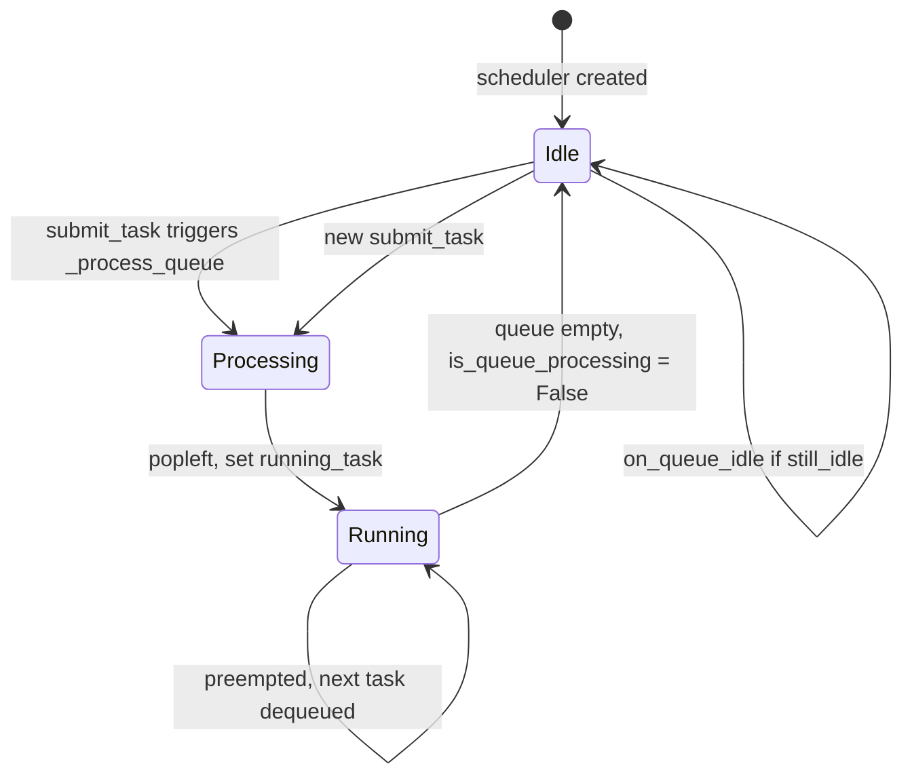

# System Architecture Workflow

## High-Level Overview

This system is a **single-scheduler, serialized async task queue** with priority filtering. Producers `await submit_task(QueuedTask)` on `ConditionalPreemptiveScheduler`; exactly one coroutine runs at a time, with optional preemption on submit, queue eviction, and per-task timeouts.



## Core Components

| Component | Responsibility |
|-----------|----------------|
| [`TaskLevel`](task_queue.py) | Priority enum: `LOW(0) < NORMAL(1) < HIGH(2) < CRITICAL(3)` |
| [`QueuedTask`](task_queue.py) | Task payload: `level`, `name`, `coroutine`, `can_interrupt_running`, `timeout` |
| [`ConditionalPreemptiveScheduler`](task_queue.py) | Enqueue filtering, preemption, queue draining, execution, and optional idle notification |

### Scheduler State

| Field | Purpose |
|-------|---------|
| `queue` | `deque[QueuedTask]` — FIFO waiting tasks |
| `running_task` | Currently executing `QueuedTask` |
| `_current_execution` | `asyncio.Task` wrapping the running coroutine |
| `is_queue_processing` | Re-entrant guard — only one `_process_queue` loop active |
| `_on_queue_idle` | Optional `Callable[..., Any] \| None` — sync hook invoked when the queue fully drains |
| `_lock` | `asyncio.Lock` — synchronizes `submit_task` and queue mutations |

### Constructor: `on_queue_idle`

Optional callback for application logic when all queued work finishes (e.g. manual turn-taking → set user turn; auto turn-taking → enable mic).

```python
from functools import partial

def on_idle(mode: str, mic_controller) -> None:
    if mode == "manual":
        set_user_turn()
    else:
        mic_controller.enable()

scheduler = ConditionalPreemptiveScheduler(
    on_queue_idle=partial(on_idle, "manual", mic_controller),
)
```

- **Type:** `Callable[..., Any] | None` (default `None` — no hook).
- **Invocation:** `idle_callback()` with no arguments; bind values ahead of time via `functools.partial`.
- **Sync only:** the scheduler calls the callable directly (no `await`); keep it fast or offload blocking work yourself.
- **When:** after the drain loop exits and state is cleared (`running_task = None`, `is_queue_processing = False`).
- **Race safety:** re-checks `not self.queue and not self.is_queue_processing` under `_lock` before invoking, so a concurrent `submit_task` does not trigger a stale idle notification.
- **Lock discipline:** the callback runs **outside** `_lock` so it can safely call `submit_task` without deadlock.

## Lifecycle: Submit to Completion



## Workflow 1: Task Submission (`submit_task`)

All submission logic runs under `asyncio.Lock` in [`ConditionalPreemptiveScheduler.submit_task`](task_queue.py).



**Priority rules on enqueue:**

- **Reject (Behavior 4):** `get_highest_active_level()` returns the max level among the running task and all queued tasks. Incoming tasks strictly below that level are rejected (covers both higher-queued and higher-running cases).
- **Evict (Behavior 3):** Remove all strictly lower-level tasks from the back before appending.
- **Preempt (Behavior 2):** After append, if queue front outranks `running_task` and has `can_interrupt_running=True`, cancel `_current_execution` immediately — preemption is triggered at submit time, not via a polling loop.
- **Trigger processing:** `create_task(_process_queue)` only when `not is_queue_processing`; an already-running drain loop picks up newly appended tasks on its next iteration.

## Workflow 2: Queue Processing (`_process_queue`)

`_process_queue` drains the queue sequentially. The `is_queue_processing` flag prevents concurrent processor loops.



**Behavior mapping:**

- **Behavior 1 (one at a time):** `_process_queue` awaits each coroutine before `popleft` on the next; `submit_task` ensures only one drain loop is started via `is_queue_processing`.
- **Behavior 2 (preemption):** Cancel on submit raises `CancelledError` in the running `wait_for`; processor logs and continues to next queued task.
- **Behavior 2 inverse:** Lower-level tasks never preempt — preemption requires `next_task_in_queue.level > running_task.level`.
- **Behavior 5 (timeout):** `asyncio.wait_for(asyncio.shield(...), timeout)` cancels overlong tasks; loop continues to next item.
- **Idle hook:** When the queue empties, optional `on_queue_idle` fires once per drain cycle (not while tasks remain queued).

## Workflow 3: Task Execution



**Timeout detail:** `asyncio.shield` prevents the inner task from being immediately destroyed on timeout/cancel at the `wait_for` boundary, giving the scheduler control over cleanup via explicit `cancel()`.

## Workflow 4: Queue Idle Hook (`on_queue_idle`)

Application code registers an optional sync callback at scheduler construction. Arguments are bound with `functools.partial` before passing the callable in — the scheduler always invokes it with `idle_callback()` and no extra parameters.



| Concern | Approach |
|---------|----------|
| Turn-taking / mic control | App logic inside `on_queue_idle`; scheduler stays domain-agnostic |
| Passing context (mode, controllers) | `functools.partial(handler, arg1, arg2, ...)` at init |
| Concurrent submit during callback | `still_idle` re-check skips hook if a new task restarted processing |
| Callback submits a new task | Safe — hook runs outside `_lock` |

## Workflow 5: Concurrency Model



| Concern | Mechanism |
|---------|-----------|
| Concurrent `submit_task` calls | `asyncio.Lock` wraps reject/evict/append/preempt decision |
| Multiple `_process_queue` invocations | `submit_task` starts drain loop only when `not is_queue_processing` |
| Preemption race | Preempt check runs inside `submit_task` lock before releasing |
| Event-driven processing | `create_task(_process_queue)` on each accepted submit (no polling) |
| Cross-thread submit | **Not supported** — `asyncio.Lock` requires event-loop thread |

## End-to-End Example (Preemption + Eviction)



## State Machine (Scheduler)



## Required Behaviors and Tests

| Behavior | Description | Test |
|----------|-------------|------|
| 1 | Only one task runs at a time | `test_only_one_task_runs_at_a_time` |
| 2a | No preempt by default | `test_higher_level_does_not_interrupt_running_task_with_can_interrupt_running_false` |
| 2b | Preempt when `can_interrupt_running=True` | `test_higher_level_interrupt_running_task_with_can_interrupt_running_true` |
| 3 | Higher-level incoming evicts lower queued | `test_higher_level_incoming_tasks_evicts_lower_queued` |
| 4a | Reject when higher-level queued | `test_do_not_enqueue_incoming_task_when_higher_queued` |
| 4b | Reject when higher-level running | `test_do_not_enqueue_incoming_task_when_higher_running` |
| 5 | Timeout stops running task | `test_task_times_out_when_exceeding_limit` |
| 6 | `on_queue_idle` runs once when queue drains | `test_on_queue_idle_runs_once_when_queue_drains` |
| 7 | `functools.partial` binds args before scheduler init | `test_on_queue_idle_partial_binds_args_before_scheduler` |

## Key Files

- Implementation: [task_queue.py](task_queue.py)
- Behavior specs: [README.md](README.md)
- Verification: [test_task_queue.py](test_task_queue.py) (8 tests)

## Known Design Notes

- `submit_task` is **async** — uses `asyncio.Lock` and must be called from the event loop.
- Preemption is **submit-driven** (cancel inside `submit_task`), not poll-driven.
- `_process_queue` pops under `_lock` but awaits each coroutine outside the lock; coordination relies on `is_queue_processing` and sequential await.
- `on_queue_idle` is optional, sync, and invoked outside `_lock` with a `still_idle` guard — use `functools.partial` to pass bound arguments at construction time.
